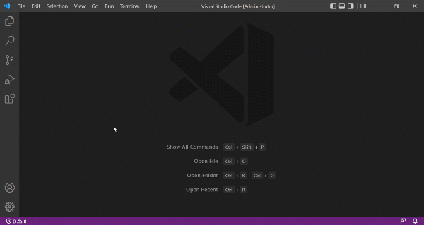

Keyboard Shortcuts make things quicker: Need to get something done fast? Use a keyboard shortcut. They let you accomplish most tasks in Visual Studio Code. You can open a list of all these shortcuts by going to the menu under File > Preferences > Keyboard Shortcuts (Code > Preferences > Keyboard Shortcuts on macOS). You can also find a list of all the keyboard shortcuts on the [Visual Studio Code Website](https://code.visualstudio.com/docs/getstarted/keybindings).